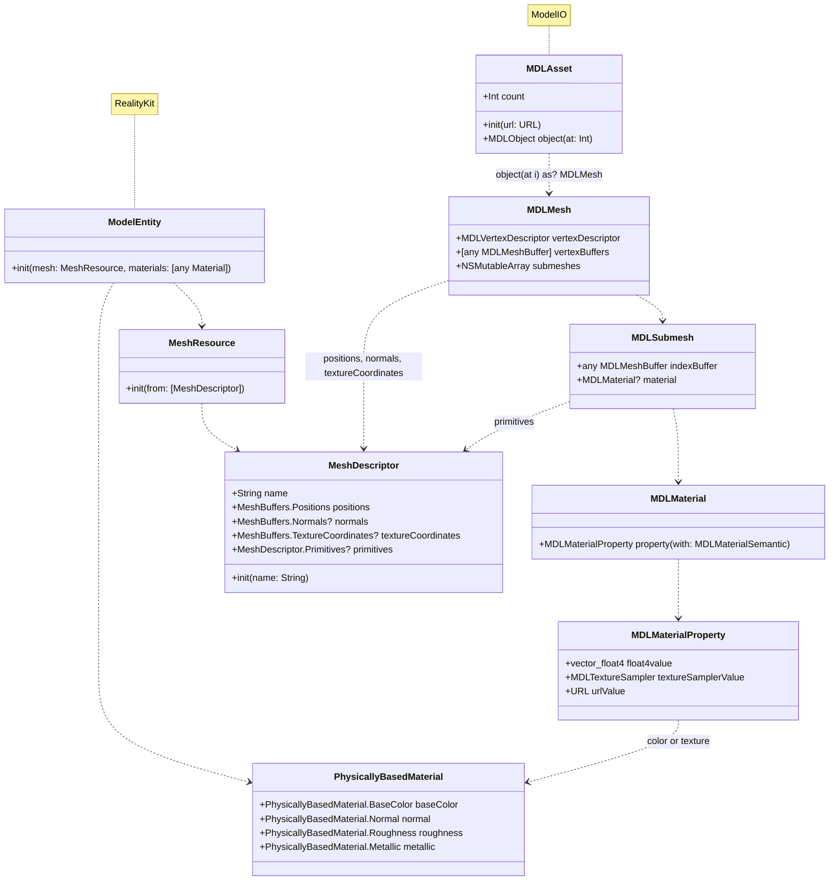

# ModelIO-to-RealityKit
Extensions to create RealityKit entities from STL, OBJ, PLY, and ABC formats supported in ModelIO

## Background

RealityKit provides native support and entity initializers for Universal Scene Description (USDA, USDC, and USDZ) formatted 3D model files.
In one of my own projects, [Augmented Reality Mobile Robotics (ARMOR)](https://www.dc-engineer.com/armor) I found I needed to support other 3D modeling formats, such as STL and OBJ, that were commonly used in the [ROS](https://www.ros.org)-compatible Unified Robot Description Format (URDF).
These file formats are supported by Apple's [ModelIO](https://developer.apple.com/documentation/modelio), which is a lower level package that loads in the models as raw data and buffers, using data types that trace back to older Objective C classes.
While there is not always an exact mapping for all 3D model formats, there is sufficient data to be unpacked from the ModelIO types to be able to generate the meshes and materials to be rendered in RealityKit.

This package contains a variety of extensions, aimed to be utilities that map the types used in ModelIO to more modern Swift arrays, and with more strict type definition, all with the intent of conversion into RealityKit.
You may refer to the individual extensions and documentation as you wish, though I recommend you stick to the minimal example at the end of this readme.
Of course, if you wish to improve on these extensions, I welcome any and all contributions.

## Installation

The package may be installed using Swift Package Manager, in XCode, as follows:github.com/radcli14/ModelIO-to-RealityKit
1. From the `File` menu, select `Add Package Dependencies`.
2. In the search bar in the upper right, enter `https://github.com/radcli14/ModelIO-to-RealityKit`.
3. Make sure your project is selected in the `Add to Project` line, then click the `Add Package` button in the lower right.
4. Make sure your target is selected in the `Add to Target` line, then click the `Add Package` button again.

## Minimal Example

The simplest entry point is to use the extension `.fromMDLAsset` with a valid `URL` for a file that can be handled by ModelIO.
That extension is `async`, and is formatted as follows:

```swift
ModelEntity.fromMDLAsset(url: URL)
```

In the example below, the project contains a Wavefront Object file named `shiny.obj` in its asset bundle.
The usage of a URL from the asset bundle is a convenience, though this extension should work for any valid file URL that the app can access.
This URL is used to initialize a `ModelEntity`, which is rendered in a `RealityView`.

```swift
import SwiftUI
import RealityKit
import ModelIO_to_RealityKit

struct ContentView: View {
    var body: some View {
        NavigationStack {
            RealityView { content in
                if let url = Bundle.main.url(forResource: "shiny", withExtension: "obj"),
                   let entity = await ModelEntity.fromMDLAsset(url: url) {
                    content.add(entity)
                }
            }
            .realityViewCameraControls(.orbit)
            .navigationTitle("Model3DLoader")
        }
    }
}
```


## Data Structure

To understand how we might convert a ModelIO-compatible data format into a RealityKit entity, we may refer to the class diagram below.
In this diagram, the key properties and functions required for this conversion are highlighted inside of their respective classes; this is not, however, a complete representation of the class.

Consider the initializer for a `ModelEntity` where we provide the `mesh` and `materials` arguments.
The former is in the form of a `MeshResource`.
This type holds the geometric representation of the mesh in an array of `MeshDescriptor`.
There are several different RealityKit Material types, but for our case, the `PhysicallyBasedMaterial` is sufficient.

On the other side, we find the `MDLAsset` type from ModelIO, which can be initialized from a `URL` of a 3D model file.
Geometry for the `MeshDescriptor` can be unpacked from `MDLMesh` and `MDLSubmesh` children of the `MDLAsset`.
The former contains vertex data, meaning the positions, normals, and texture (i.e. UV) coordinates of each vertex, in a buffer.
The latter contains mesh primitives, meaning indices associated with each face of the mesh.

The `MDLSubmesh` also holds material data, meaning color or image textures for that section of the mesh (for many objects, there is only a single submesh).
This data can be unpacked from the `material` variable, which itself contains various `MDLMaterialProperty` instances.
Each of these can be converted to a form required by similar properties of the RealityKit `PhysicallyBasedMaterial`.


