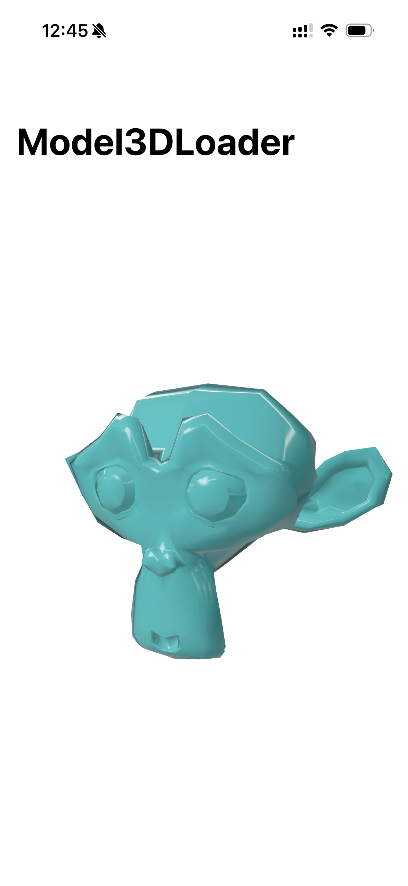
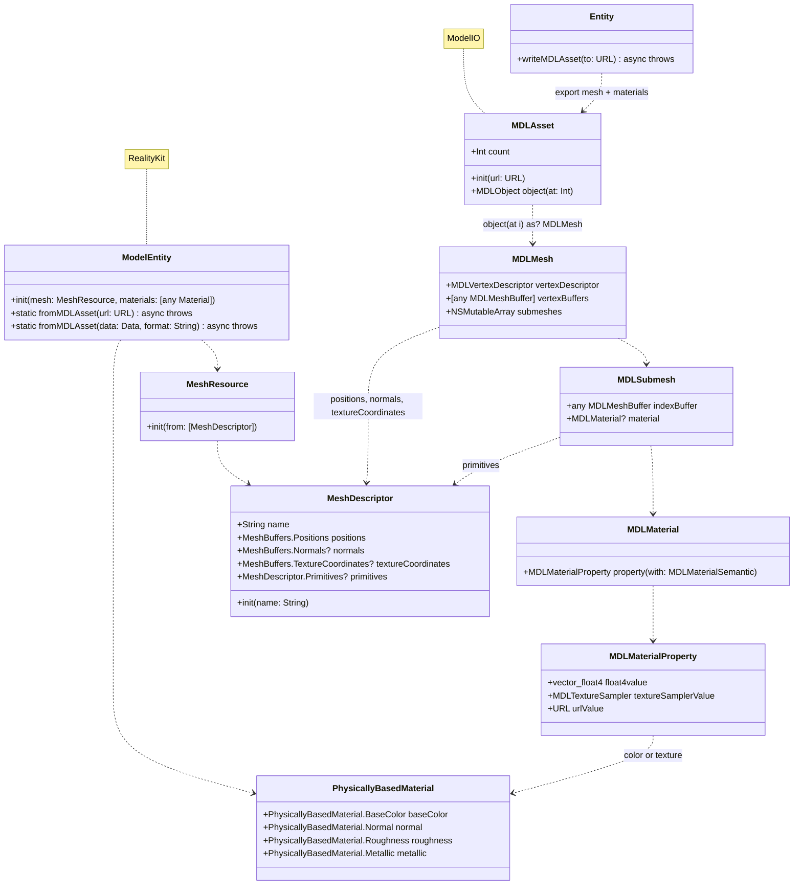

# ModelIO-to-RealityKit
Extensions to load and export 3D models between ModelIO-compatible formats and RealityKit

## Background

RealityKit provides native support and entity initializers for Universal Scene Description (USDA, USDC, and USDZ) formatted 3D model files.
In one of my own projects, [Augmented Reality Mobile Robotics (ARMOR)](https://www.dc-engineer.com/armor) I found I needed to support other 3D modeling formats, such as STL and OBJ, that were commonly used in the [ROS](https://www.ros.org)-compatible Unified Robot Description Format (URDF).
These file formats are supported by Apple's [ModelIO](https://developer.apple.com/documentation/modelio), which is a lower level package that loads in the models as raw data and buffers, using data types that trace back to older Objective C classes.
While there is not always an exact mapping for all 3D model formats, there is sufficient data to be unpacked from the ModelIO types to be able to generate the meshes and materials to be rendered in RealityKit.

This package also provides the reverse direction: any RealityKit `Entity` tree can be exported to a file on disk via `writeMDLAsset(to:)`.
When exporting to USDZ, PBR texture maps (base color, normal, roughness, metallic, emissive, and ambient occlusion) are extracted from `TextureResource` using Metal and embedded directly in the archive, producing a self-contained file that loads correctly in QuickLook and RealityKit.

## Installation

The package may be installed using Swift Package Manager, in XCode, as follows:github.com/radcli14/ModelIO-to-RealityKit
1. From the `File` menu, select `Add Package Dependencies`.
2. In the search bar in the upper right, enter `https://github.com/radcli14/ModelIO-to-RealityKit`.
3. Make sure your project is selected in the `Add to Project` line, then click the `Add Package` button in the lower right.
4. Make sure your target is selected in the `Add to Target` line, then click the `Add Package` button again.

## Supported Formats

Both loading and exporting rely on ModelIO's format support.

| Format | Extension | Load | Export |
|--------|-----------|:----:|:------:|
| STL | `.stl` | ✓ | ✓ |
| Wavefront OBJ | `.obj` | ✓ | ✓ |
| Stanford PLY | `.ply` | ✓ | ✓ |
| Alembic | `.abc` | ✓ | ✓ |
| USD ASCII | `.usda` | ✓ | ✓ |
| USDZ | `.usdz` | ✓ | ✓ |

## Loading Models

The simplest entry point is `ModelEntity.fromMDLAsset(url:)` with a valid `URL` for a file that ModelIO can read.

```swift
let entity = try await ModelEntity.fromMDLAsset(url: url)
```

If your file arrives as raw `Data` rather than a URL (e.g. downloaded from a server), use the `data:format:` overload and supply the file extension as the format string:

```swift
let entity = try await ModelEntity.fromMDLAsset(data: fileData, format: "obj")
```

In the example below, the project contains a Wavefront Object file named `shiny.obj` in its asset bundle.
The usage of a URL from the asset bundle is a convenience, though this extension should work for any valid file URL that the app can access.
This URL is used to initialize a `ModelEntity`, which is rendered in a `RealityView`.

```swift
import SwiftUI
import RealityKit
import ModelIO_to_RealityKit

struct ContentView: View {
    var body: some View {
        NavigationStack {
            RealityView { content in
                if let url = Bundle.main.url(forResource: "shiny", withExtension: "obj") {
                    do {
                        let entity = try await ModelEntity.fromMDLAsset(url: url)
                        content.add(entity)
                    } catch {
                        print("Failed to load entity: \(error.localizedDescription)")
                    }
                }
            }
            .realityViewCameraControls(.orbit)
            .navigationTitle("Model3DLoader")
        }
    }
}
```



## Exporting Models

Any `Entity` in a RealityKit scene can be written to a file using `writeMDLAsset(to:)`.
The output format is determined by the file extension of the destination URL.

```swift
let url = URL.documentsDirectory.appendingPathComponent("model.usdz")
try await entity.writeMDLAsset(to: url)
```

### USDZ texture embedding

When the destination is a `.usdz` file, the exporter:

1. Renders each `PhysicallyBasedMaterial` texture (base color, normal, roughness, metallic, emissive, ambient occlusion) from its `TextureResource` via Metal and writes it as a PNG.
2. Generates a proper USD material graph (`UsdPreviewSurface` + `UsdUVTexture` + `UsdPrimvarReader_float2`) with scalar fallbacks for any untextured properties.
3. Packages the USDA stage and all PNG files into a ZIP archive that conforms to the USDZ specification, including 64-byte alignment of every file entry.

The resulting `.usdz` is self-contained and compatible with QuickLook and `Entity(contentsOf:)`.

## Data Structure

To understand how we might convert a ModelIO-compatible data format into a RealityKit entity, we may refer to the class diagram below.
In this diagram, the key properties and functions required for this conversion are highlighted inside of their respective classes; this is not, however, a complete representation of the class.

Consider the initializer for a `ModelEntity` where we provide the `mesh` and `materials` arguments.
The former is in the form of a `MeshResource`.
This type holds the geometric representation of the mesh in an array of `MeshDescriptor`.
There are several different RealityKit Material types, but for our case, the `PhysicallyBasedMaterial` is sufficient.

On the other side, we find the `MDLAsset` type from ModelIO, which can be initialized from a `URL` of a 3D model file.
Geometry for the `MeshDescriptor` can be unpacked from `MDLMesh` and `MDLSubmesh` children of the `MDLAsset`.
The former contains vertex data, meaning the positions, normals, and texture (i.e. UV) coordinates of each vertex, in a buffer.
The latter contains mesh primitives, meaning indices associated with each face of the mesh.

The `MDLSubmesh` also holds material data, meaning color or image textures for that section of the mesh (for many objects, there is only a single submesh).
This data can be unpacked from the `material` variable, which itself contains various `MDLMaterialProperty` instances.
Each of these can be converted to a form required by similar properties of the RealityKit `PhysicallyBasedMaterial`.


```mermaid
classDiagram
    note for MDLAsset "ModelIO"
    note for ModelEntity "RealityKit"

    MDLAsset ..> MDLMesh : object(at i) as? MDLMesh
    MDLMesh ..> MDLSubmesh
    MDLSubmesh ..> MDLMaterial
    MDLMaterial ..> MDLMaterialProperty

    class MDLAsset {
        +Int count
        +init(url: URL)
        +MDLObject object(at: Int) 
    }

    class MDLMesh {
        +MDLVertexDescriptor vertexDescriptor 
        +[any MDLMeshBuffer] vertexBuffers
        +NSMutableArray submeshes 
    }

    class MDLSubmesh {
        +any MDLMeshBuffer indexBuffer
        +MDLMaterial? material
    }

    class MDLMaterial {
        +MDLMaterialProperty property(with: MDLMaterialSemantic)
    }

    class MDLMaterialProperty {
        +vector_float4 float4value
        +MDLTextureSampler textureSamplerValue
        +URL urlValue
    }

    ModelEntity ..> MeshResource
    ModelEntity ..> PhysicallyBasedMaterial
    MeshResource ..> MeshDescriptor
    class ModelEntity {
        +init(mesh: MeshResource, materials: [any Material])
        +static fromMDLAsset(url: URL) async throws
        +static fromMDLAsset(data: Data, format: String) async throws
    }

    class MeshResource {
        +init(from: [MeshDescriptor])
    }

    class MeshDescriptor {
        +String name
        +MeshBuffers.Positions positions
        +MeshBuffers.Normals? normals
        +MeshBuffers.TextureCoordinates? textureCoordinates
        +MeshDescriptor.Primitives? primitives
        +init(name: String)
    }

    class PhysicallyBasedMaterial {
        +PhysicallyBasedMaterial.BaseColor baseColor
        +PhysicallyBasedMaterial.Normal normal
        +PhysicallyBasedMaterial.Roughness roughness
        +PhysicallyBasedMaterial.Metallic metallic 
    }

    MDLMesh ..> MeshDescriptor : positions, normals, textureCoordinates
    MDLSubmesh ..> MeshDescriptor : primitives
    MDLMaterialProperty ..> PhysicallyBasedMaterial : color or texture

    class Entity {
        +writeMDLAsset(to: URL) async throws
    }
    Entity ..> MDLAsset : export mesh + materials
```
